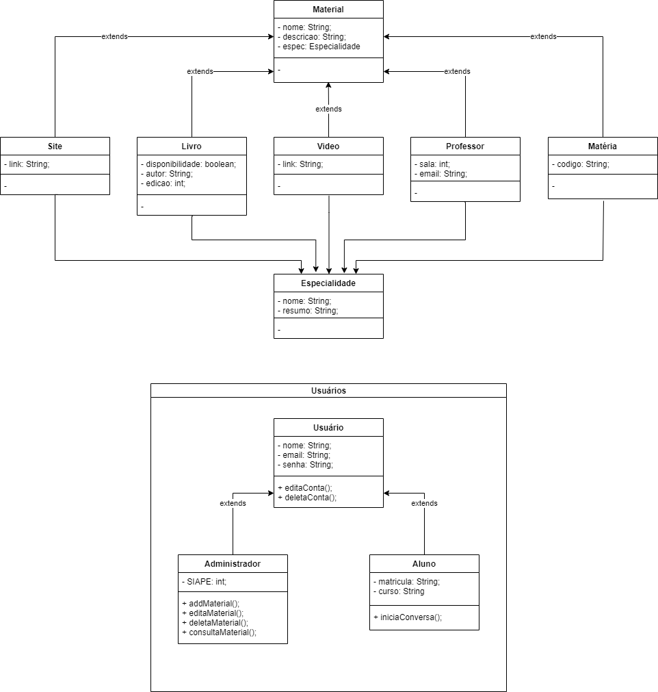
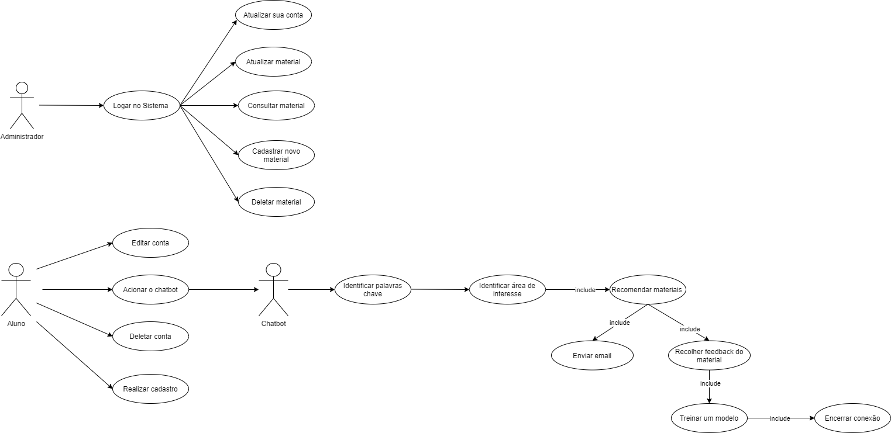

# Chatbot para Orientação de Alunos na Área de Computação

---

 

  

 

## 📖 Perspectiva Geral
O Sistema **"Chatbot para Orientação de Alunos na Área de Computação"** tem como objetivo auxiliar estudantes da UFJF a encontrar materiais educacionais, tais como matérias eletivas/optativas na faculdade, cursos além do âmbito acadêmico, fontes de informações, entre outros que contribuam para uma formação voltada para o campo de maior afinidade do aluno. Chatbot desenvolvido para a disciplina de **engenharia de software 2020.3 da Universidade Federal de Juiz de Fora**.

 

---

 

## 📋 Lista de Requisitos

 

#### Requisitos Funcionais

 

 Título                           |   Descrição  
 :--------------:                 |   :-------: 
 [RF001] - Realizar Cadastro de Aluno | O sistema deve ser capaz de registar um **nome**, **matrícula** **e-mail**, **curso** e **senha** e guardar essa informação em um banco de dados.
 [RF002] - Realizar login de Aluno | O sistema deve ser capaz de validar o login de um aluno a partir de sua **matrícula** e **senha** e direcioná-lo para sua página inicial.
 [RF003] - Editar Conta | Através do sistema o aluno deve ser capaz de editar a sua conta, mudando os campos desejados.
 [RF004] - Deletar Conta | O sistema deve permitir que um aluno apague a sua conta do banco de dados.
 [RF005] - Adicionar site | O sistema deve permitir que um administrador adicione um site que poderá ser recomendado, inserindo as informações referentes ao **nome**, **descrição**, **especialidade** e **link** do mesmo.
 [RF006] - Editar site | O sistema deve permitir que um administrador edite as informações dos sites que foram disponibilizados na plataforma.
 [RF007] - Deletar site | O sistema deve permitir que um administrador delete um ou mais sites da plataforma.
 [RF008] - Consultar site | O sistema deve permitir que um administrador consulte as informações dos sites disponíveis.
 [RF009] - Adicionar livro | O sistema deve permitir que um administrador adicione um livro que poderá ser recomendado, inserindo as informações referentes ao **nome**, **descrição**, **especialidade**, **disponibilidade**, **autor** e **edição** do mesmo.
 [RF010] - Editar livro | O sistema deve permitir que um administrador edite as informações dos livros que foram disponibilizados na plataforma.
 [RF011] - Deletar livro | O sistema deve permitir que um administrador delete um ou mais livros da plataforma.
 [RF012] - Consultar livro | O sistema deve permitir que um administrador consulte as informações dos livros disponíveis.
 [RF013] - Adicionar professor | O sistema deve permitir que um administrador adicione um professor que poderá ser recomendado, inserindo as informações referentes ao **nome**, **descrição** (null), **especialidade**, **sala** e **email** do mesmo.
 [RF014] - Editar professor | O sistema deve permitir que um administrador edite as informações dos professores que foram disponibilizados na plataforma.
 [RF015] - Deletar professor | O sistema deve permitir que um administrador delete um ou mais professores da plataforma.
 [RF016] - Consultar professor | O sistema deve permitir que um administrador consulte as informações dos professores disponíveis.
 [RF017] - Adicionar vídeo | O sistema deve permitir que um administrador adicione um vídeo que poderá ser recomendado, inserindo as informações referentes ao **nome**, **descrição**, **especialidade** e **link** do mesmo.
 [RF018] - Editar vídeo | O sistema deve permitir que um administrador edite as informações dos vídeos que foram disponibilizados na plataforma.
 [RF019] - Deletar vídeo | O sistema deve permitir que um administrador delete um ou mais vídeos da plataforma.
 [RF020] - Consultar vídeo | O sistema deve permitir que um administrador consulte as informações dos vídeos disponíveis.
 [RF021] - Adicionar matéria | O sistema deve permitir que um administrador adicione uma matéria disponível na UFJF que poderá ser recomendada, inserindo as informações referentes ao **nome**, **descrição**, **especialidade** e **código** da mesma. 
 [RF022] - Editar matéria | O sistema deve permitir que um administrador edite as informações das matérias que foram disponibilizadas na plataforma.
 [RF023] - Deletar matéria | O sistema deve permitir que um administrador delete uma ou mais matérias da plataforma.
 [RF024] - Consultar matéria | O sistema deve permitir que um administrador consulte as informações das matérias disponíveis. 
 [RF025] - Identificar área de interesse | O sistema deve ser capaz de reconhecer qual a área que o aluno tem mais afinidade a partir da conversa e dos dados coletados, traçando uma métrica.
 [RF026] - Recomendar materiais | O sistema deve, a partir da área de afinidade do aluno, recomendar os materiais adequados disponíveis na biblioteca, sendo eles: **sites**, **livros**, **vídeos**, **matérias**.
 [RF027] - Enviar email | O sistema deve, ao final da pesquisa, enviar um e-mail para o aluno com todos os materiais recomendados reunidos.
 [RF028] - Recolher Feedback do material já consumido | O sistema deve recolher uma avaliação do material recomendado, uma vez que o aluno já o tenha consumido, a fim de atualizar sua nota quanto à qualidade.
 [RF029] - Treinar um modelo | O sistema deverá utilizar o feedback dos alunos para melhorar a recomendação dos materiais por parte da IA.
 [RF030] - Identificar palavras-chave | O chatbot deve ser capaz de reconhecer alguns sinônimos das palavras-chaves utilizadas por estudantes a fim de tornar a recomendação mais assertiva.
 [RF031] - Encerramento de Conexão | O chatbot ser capaz de encerrar uma conversa assim que o aluno obter sua recomendação desejada.

     

 

#### Requisitos Não Funcionais

 

Título                        |   Descrição  
 :--------------:             |   :-------: 
 [RNF01] - Plataforma web | O sistema deverá funcionar no navegador Google Chrome.
 [RNF02] - Tempo de resposta das listagens | O tempo de resposta das listagens não deve ser superior a 5 (dois) segundos.
 [RNF03] - Experiência do usuário | O sistema deve ser de fácil uso pelos usuários.
 [RNF04] - Disponibilidade online | O Sistema deve estar disponível para uso dos alunos a qualquer momento.
 [RNF05] - Ferramentas | O Sistema deve ser desenvolvido usando as bibliotecas Chatterbot (...) disponíveis da linguagem Python. Para a plataforma Web será usado HTML5, CSS3, JavaScript. (...). 
 [RNF06] - Incrementação | O Sistema deverá aceitar um aprimoramento na sua métrica de recomendação por meio de algoritmos em Python.
 [RNF07] - Inatividade | O sistema deve, caso fique muito tempo sem resposta, abandonar a conversa atual e encerrar a conexão.
 [RNF08] - Conversa Fluida | O chatbot deve ser capaz de manter uma conversa fluída e de fácil usabilidade.
 [RNF09] - Sistema Operacional | O chatbot deve ser compatível com os sistemas operacionais Windows. 
 [RNF10] - Não funcionamento offline | O chatbot não será capaz de armazenar respostas offline para serem usadas caso a conexão com internet seja interrompida.

 

---

 

## 📊 Diagramas

 

#### Diagrama de Classes

 

  

 

#### Diagrama de Casos de Uso

 

  

 

---

 

## 📝 Protótipo

 

